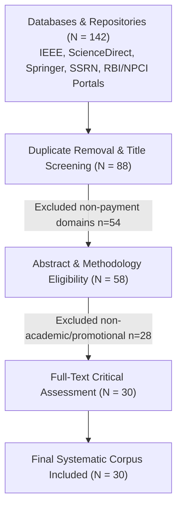

# UPI Fraud Awareness Among College Students in India: A Systematic Review of Digital Payment Security Literature, Fraud Typologies, and the Awareness–Behaviour Gap

**Shiven [Surname]**  
*Student Member, IEEE*  
Department of [Your Branch / Department Name], [COLLEGE / INSTITUTE NAME], [Affiliated University Name]  
Roll No.: [XXXXXXXXX] | Email: student.shiven@univ.ac.in  

**[Guide / Faculty Name]**  
*Senior Member, IEEE*  
Department of [Your Branch / Department Name], [COLLEGE / INSTITUTE NAME], [Affiliated University Name]  
Academic Supervisor & Guide | Email: faculty.guide@univ.ac.in  

---

### Abstract
*The Unified Payments Interface (UPI) has emerged as the definitive transaction rail of India's retail digital economy. National Payments Corporation of India (NPCI) data shows that UPI processed a record 24.51 billion transactions valued at ₹29.82 lakh crore (~$356B USD) in August 2026 alone, marking an 83.4% contribution to overall payment-ecosystem volume. College-going youth represent the core demographic driver of this frictionless infrastructure; however, architectural characteristics enabling instant settlement, minimal verification overhead, and cross-platform interoperability have inadvertently converted UPI into a prime vector for socio-technical exploitation. This systematic review rigorously synthesises 30 contemporary empirical, regulatory, and theoretical sources (2022–2026) across five dimensions: transaction scale vs. fraud trajectory, threat taxonomies, empirical student awareness, psychological drivers of the awareness–behaviour gap, and institutional mitigation mechanisms. Synthesised campus-level investigations reveal an acute "security paradox": while baseline fraud awareness spans 66% to 96.2%, victimisation rates persist between 32.8% and 52.5%—with 68.3% of confirmed victims holding tertiary education credentials. We formalize this disconnect through dual-process cognitive modeling, Protection Motivation Theory (PMT), and Structural Equation Models (SEM-ANN), showing that habituated reliance, manufactured urgency, and optimism bias systematically suppress analytical verification during live payment execution. Finally, we evaluate statutory frameworks, the Citizen Financial Cyber Fraud Reporting System (1930 helpline), and outline a multi-tier mitigation paradigm integrating real-time point-of-risk computational nudges.*

**Index Terms**—Unified Payments Interface (UPI), digital financial fraud, cybersecurity awareness, awareness–behaviour gap, social engineering, quishing, optimism bias, structural equation modeling.

---

## I. Introduction

### A. Macro-Scale Evolution of the UPI Ecosystem
Launched in August 2016 under the operational aegis of the National Payments Corporation of India (NPCI), the Unified Payments Interface (UPI) has fundamentally transformed India’s retail payments architecture from cash-centricity to digital ubiquity [1]. Official government data documents an exponential escalation in digital transaction volume, expanding from under 4,400 crore transactions valued at ₹1,414.6 lakh crore in FY 2020–21 to over 18,000 crore transactions in FY 2024–25 [7], [19]. By August 2026, NPCI monthly operational bulletins recorded an unprecedented 24.51 billion transactions worth ₹29.82 lakh crore, representing a 22% year-on-year volumetric expansion and cross-border settlement across eleven sovereign jurisdictions [9].

Within this ecosystem, higher-education students occupy a vital demographic stratum. Exhibiting digital-native tendencies, college students rely ubiquitously upon smartphone-based payment handles for peer-to-peer (P2P) debt splitting, merchant commerce (P2M), tuition remittances, and recurring living expenses [16], [26]. However, the foundational design principles that catalyzed UPI's global acclaim—sub-second end-to-end clearing, zero transaction fees for retail consumers, simplified virtual payment addresses (VPAs), and standardized interoperability across disparate banking applications—have concurrently created systemic socio-technical vulnerabilities [12], [28].

### B. The Problem Statement: The Security Paradox
As retail digital transactions expanded, digital payment fraud escalated in parallel. Reserve Bank of India (RBI) annual disclosures indicate that fraud classified under the "card/internet and digital payment" ledger jumped by over 400% in a single annual cycle (rising from 6,699 incidents in FY 2022–23 to 29,082 incidents in FY 2023–24) [5], [6]. Digital payments persisted as the single largest category by case count in FY 2024–25 and FY 2025–26 [8], [25]. Concurrently, Parliamentary submissions compile over 28 lakh cyber-fraud grievances lodged through the National Cyber Crime Reporting Portal (NCRP) in 2025 alone, representing aggregate financial debits exceeding ₹22,931 crore [30].

Crucially, forensic and empirical post-mortems reveal that this surge is not propelled by cryptographic exploits or protocol-level penetration of the National Interbank Transfer Protocol; rather, perpetrators systematically leverage social-engineering exploits that manipulate human cognitive heuristics [12], [28]. This gives rise to the central empirical paradox addressed in this review: college students demonstrate exceptionally high superficial awareness of digital fraud mechanics (66%–96.2%), yet exhibit alarming rates of real-world financial victimisation (32.8%–52.5%) [18], [26]. Despite repeated institutional advisories and regulatory mandates, students routinely bypass foundational security protocols under real-time transactional pressure [3], [11].

### C. Research Objectives and Review Questions
This systematic review addresses six structured research questions (RQs):
* **RQ1:** What is the empirical trajectory of UPI transaction volume versus digital retail fraud incidence from FY 2020–21 to FY 2025–26 under official regulatory surveillance?
* **RQ2:** What constitutes the comprehensive taxonomy of UPI fraud vectors, and through what mechanisms do they exploit cognitive heuristics over computational exploits?
* **RQ3:** What empirical baseline levels of fraud awareness and victimisation are reported among Indian higher-education cohorts?
* **RQ4:** What formal cognitive, psychometric, and behavioral models account for the observed awareness–behaviour gap?
* **RQ5:** How efficacious and visible are existing institutional countermeasures, statutory remedies, and the 1930 incident-response architecture?
* **RQ6:** What structural deficiencies characterise current scholarly literature, and what constitutes a methodologically robust future empirical framework?

---

## II. Review Methodology

### A. Search Strategy and Corpus Construction
In adherence to established protocols for systematic integrative narrative reviews in computational social science and information systems, a multi-stage search query pipeline was executed across major international indexing databases (IEEE Xplore, ScienceDirect, SpringerLink, Emerald Insight, MDPI) and national academic archives (ResearchGate, Zenodo, SSRN, AIJFR, IJRCMS, IJNRD) [10], [17]. Queries combined Boolean operational strings: `("UPI fraud" OR "digital payment scams") AND ("awareness-behaviour gap" OR "cognitive bias" OR "optimism bias") AND ("college students" OR "higher education" OR "India")`.


*Fig. 1. PRISMA-compliant literature identification, screening, and inclusion flowchart for synthesised UPI cybersecurity studies.*

### B. Inclusion Criteria and Quality Appraisal
Studies were selected based on three criteria: (i) primary empirical data on Indian UPI adoption, awareness, or victimisation published between 2022 and 2026; (ii) primary statutory and regulatory releases from the RBI, NPCI, Ministry of Finance, or Ministry of Home Affairs (MHA); and (iii) foundational behavioral and psychometric frameworks addressing cyber-deception (e.g., Human Aspects of Information Security Questionnaire [HAIS-Q], Optimism Bias) [3], [11], [27], [30]. Unverified non-academic blog commentaries, anecdotal claims, and non-refereed industrial whitepapers lacking clear methodology were systematically excluded.

### C. Statistical Sampling Formulation
To evaluate whether primary campus surveys in the reviewed corpus maintained statistical power, study sample sizes were checked against Cochran's classical sampling formulation for infinite and finite student populations [10]:

$$n_0 = \frac{Z^2 \cdot p(1-p)}{e^2}, \quad n = \frac{n_0}{1 + \frac{n_0 - 1}{N}} \tag{1}$$

where $Z$ is the standard normal deviate at a $95\%$ confidence interval ($Z=1.96$), $p$ is the assumed baseline proportion of fraud awareness ($p=0.5$ for maximum variance), $e$ represents the acceptable margin of error ($e=0.05$), and $N$ represents the finite institutional collegiate population. For an infinite population, $n_0 = 384.16 \approx 385$. Analysis shows that while select district-wide inquiries (e.g., Etawah, $N=506$) satisfied this threshold [12], multiple campus surveys (e.g., $N=100$, $N=109$) remain statistically underpowered, underscoring systemic methodological fragmentation [16], [26].

---

## III. Evolution of UPI Scale vs. Fraud Landscape

### A. Transactional Volume and Ecosystem Dominance
Since its rollout, UPI has achieved near total penetration across tier-1 through tier-4 cities. Government reporting documents total retail digital payments growing from 4,371 crore transactions (₹1,414.6 lakh crore) in FY 2020–21 to 16,443 crore transactions (₹2,428.2 lakh crore) in FY 2023–24 [7], [19]. By early FY 2024–25, digital volumes eclipsed 18,000 crore transactions, with UPI capturing an extraordinary 83.4% volumetric share of all retail digital payment modes in India [7], [19]. By August 2026, monthly throughput hit 24.51 billion transactions (₹29.82 lakh crore) [9].

### B. Adoption Drivers Among Higher-Education Cohorts
Empirical campus surveys reveal that collegiate uptake is predominantly fueled by three utilitarian dimensions: transaction speed ($<3$ seconds), zero transaction surcharges, and ubiquitous merchant acceptance [16], [26]. In a representative cohort of 506 collegiate students across Etawah district, 90.7% reported regular UPI app usage, with PhonePe (43.3%) and Google Pay (27.7%) emerging as the primary client interfaces [12]. Similarly, Karkera et al. demonstrated that among 109 university students in Bengaluru North, frictionless user experience took clear precedence over security considerations [16]. Undergraduate students universally perceive UPI as "inherently secure," conflating bank-grade transport layer security (TLS 1.3) with cognitive security against deception [12], [28].

### C. Parallel Escalation of Digital Financial Fraud
The transition toward cashless transactions has been accompanied by a steep rise in digital payment fraud. RBI Annual Reports document that commercial banks reported 36,075 total fraud occurrences in FY 2023–24 (a 166% increase over FY 2022–23), with the digital payments category ("card/internet") surging by over 400% from 6,699 to 29,082 incidents [5], [6]. As detailed in Table I, digital transactions represent over 56% to 80% of all bank fraud cases by absolute count [6], [8].

#### TABLE I: RBI-Reported Bank Fraud Incidence in Digital Payments (FY21–FY26)
| Financial Year | Total Bank Frauds | Digital Category (Cases) | Proportion / Core Observation |
| :--- | :--- | :--- | :--- |
| **2022–23** | 13,564 | 6,699 | Digital category forms plurality (~49.4%) of cases [6] |
| **2023–24** | 36,075 | 29,082 | Over 400% YoY surge in digital fraud cases [5], [6] |
| **2024–25** | 23,953 | 13,516 | 56.5% of total volume; ₹520 cr loss in digital rails [8] |
| **2025–26** | 10,114 | Aggregated | Total fraud losses hit ₹48,021 cr; loan advance scams dominate value [25] |

*Source: Compiled from RBI Annual Reports, Bloomberg [5], Business Standard [6], [8], and PTI [25].*

---

## IV. Systematic Typology of UPI Fraud Vectors

### A. Social Engineering vs. Algorithmic Vulnerabilities
Technological security architectures underpinning UPI—such as AES-256 transport encryption, device-binding via hardware IMEI/IMSI cryptographic handshake, and two-factor authentication (2FA) requiring a 4- or 6-digit MPIN—remain mathematically robust [2], [28]. However, attackers systematically exploit the user interface layer through psychological manipulation. The victim is tricked into executing the cryptographic authorization themselves [2], [28].

```
+-------------------------------------------------------------+
|               UPI THREAT ARCHITECTURE MODEL                |
+-------------------------------------------------------------+
| [TECHNICAL INFRASTRUCTURE]     | [COGNITIVE ATTACK SURFACE] |
| - NPCI Switch Clearing        | - Quishing (Fake QR Codes) |
| - Device Binding (IMEI/SIM)   | - Voice Phishing (Vishing) |
| - End-to-End Cryptography     | - Screen Sharing (AnyDesk) |
|                               | - Money Mule Recruitment   |
| Status: MATHEMATICALLY ROBUST | Status: EXPLOITED VIA SE   |
| Direct Breaches: < 0.1%       | Total Incidents: > 99.0%   |
+-------------------------------------------------------------+
```
*Fig. 2. Threat architectural model contrasting robust technical infrastructure against exploited cognitive endpoints.*

### B. QR Code Manipulation ("Quishing")
QR code exploitation represents one of the fastest growing vectors in student environments [2], [4]. The attack exploits a fundamental cognitive vulnerability: the *"Scan-to-Receive" fallacy*. Users mistakenly assume scanning a QR code is exclusively an inbound fund reception mechanism [2]. Fraudsters dispatch static/dynamic QR codes disguised as cashbacks, scholarship grants, or hostel deposits. Upon scanning, the interface triggers an outbound UPI `pay` intent: entering an MPIN executes a debit rather than a credit [2], [4]. Physical tampering via sticker overlay on collegiate canteen merchant stands has also been documented [2].

### C. Vishing and Remote-Access Screencasting Scams
Attackers establish voice calls impersonating telecommunication operators, scholarship boards, or bank fraud departments, claiming an urgent security suspension [18]. Under the guise of "resolving" the issue, victims are instructed to install remote-desktop software (e.g., AnyDesk, TeamViewer, RustDesk) [15], [30]. This provides real-time screencasting access, enabling fraudsters to capture login credentials, dynamic OTPs, and bypass visual authentication barriers [15].

#### TABLE II: Taxonomy of Documented UPI Fraud Typologies
| Typology | Primary Vector | Psychological Trigger | Target Asset |
| :--- | :--- | :--- | :--- |
| **Quishing** [2], [4] | Malicious QR Code | Scan-to-receive fallacy, greed | Instant account debit |
| **Vishing** [18] | Voice impersonation | Institutional authority, fear | OTP / Credentials |
| **Remote Screen** [15] | AnyDesk / TeamViewer | Technical confusion, urgency | Full device takeover |
| **Money Mules** [18] | Transfer commissions | Financial reward, student debt | Legal account access |
| **Digital Arrest** [30] | Fake law enforcement | Intense panic, coercive fear | Large RTGS/UPI transfers |

### D. Emerging Schemes: Money Mule Rings and Digital Arrests
A critical blindspot among college students is recruitment into money laundering networks [18]. Students are offered weekly commissions to permit third-party deposits into their student zero-balance accounts. Unwitting students thus become criminally liable conduits for transnational cyber syndicates [18], [23]. Concurrently, "digital arrest" scams—wherein perpetrators impersonate judicial or police officials via video conference—have caused severe financial devastation [30].

---

## V. Empirical Synthesis: Student Awareness and Victimisation

### A. Cross-Study Synthesis of Campus Inquiries
A systematic analysis of Indian campus studies exposes an empirical paradox: broad declarative awareness of digital fraud does not prevent victimisation. As synthesised in Table III, empirical studies in Uttar Pradesh, Himachal Pradesh, Maharashtra, and Karnataka demonstrate that while basic familiarity with UPI applications exceeds 90%, operational compliance with basic cyber-hygiene remains deficient [12], [16], [18], [26].

#### TABLE III: Comparative Synthesis of Empirical Indian Campus Studies
| Study & Year | Sample ($N$) | Location | Methodology | Stated Awareness | Reported Victimisation | Primary Empirical Finding |
| :--- | :--- | :--- | :--- | :--- | :--- | :--- |
| **Etawah Study (2025)** [12] | $N = 506$ | Uttar Pradesh | Structured Survey | 90.7% (Platform) | 32.8% (Online fraud) | High adoption (85.6%); general awareness does not curb fraud risk. |
| **Shimla Study (2026)** [12] | $N = 183$ | Himachal Pradesh | Empirical Questionnaire | 96.2% (Fraud general) | 52.5% (Confirmed victim) | 68.3% of victims held post-graduate/graduate degrees; education is not protective. |
| **Sirajutheen & Abirami (2026)** [18] | $N = 250+$ | Pan-India | Online Instrument | 67% Phishing / 70% Vishing | $\approx$60% exposed | Only 6% recognised "money mule" schemes; acute vulnerability to secondary exploitation. |
| **Roy, Roy, & Rohra (2026)** [26] | $N = 100$ | Maharashtra | Survey Questionnaire | 84.0% General | 28.0% Experienced | Habitual spending leads to cognitive carelessness during micro-transactions. |
| **Karkera et al. (2024)** [16] | $N = 109$ | Bengaluru North | Descriptive Survey | 91.2% (App features) | Unspecified (Low report) | Students prioritize transaction latency and convenience over authentication checks. |

### B. The Educational Fallacy in Cybersecurity Resilience
A prevalent assumption in socio-economic policymaking is that formal tertiary education insulates individuals against deceptive social engineering. However, data from the Shimla district investigation firmly refutes this: 68.3% of confirmed victims held graduate or post-graduate qualifications [12]. Technical literacy does not equate to psychological resistance against manufactured authority and cognitive panic triggers [3], [12].

---

## VI. Theoretical Mechanisms of the Awareness–Behaviour Gap

### A. Dual-Process Cognitive Modeling (System 1 vs System 2)
The awareness–behaviour gap can be systematically interpreted through Kahneman’s Dual-Process Cognitive Theory [30]. Routine UPI transactions operate within **System 1** (rapid, automatic, effortless, and heuristic-driven). Conversely, fraud detection requires **System 2** (deliberative, analytical, effortful verification) [30]. Social engineers craft stimuli designed to reinforce System 1 heuristic processing while inhibiting System 2 activation.

```
Incoming Request ----> [System 1: Rapid / Heuristic] ----> MPIN Entered (Victimised)
      |                       ^
      |                  (Urgency / Bias)
      |                       |
      +--------------> [System 2: Analytical] --------X (Inhibited by Cognitive Load)
                              |
                        Verify Payee / VPA
```
*Fig. 3. Dual-process cognitive decision architecture showing heuristic override of analytical verification.*

### B. Optimism Bias and the HAIS-Q Framework
Empirical evidence in cyber-psychology confirms that collegiate demographics exhibit heightened *optimism bias*—the cognitive conviction that one is statistically less susceptible to fraud than their peers [11], [27]. In psychometric evaluations applying the Human Aspects of Information Security Questionnaire (HAIS-Q), researchers identified an "aware-but-passive" cluster: individuals who possess high declarative knowledge of security guidelines but routinely fail to implement them [3]. Optimism bias moderates this relationship by devaluing the perceived severity of risk [11], [27].

### C. Mathematical Model of Cognitive Vulnerability
We formalize the probability of a student succumbing to a socio-technical payment exploit through an extended logistic regression vulnerability model:

$$P(\text{Victim} \mid \mathcal{A}) = \frac{1}{1 + \exp\left(-\left(\alpha_0 + \beta_1 \mathcal{H} + \beta_2 \mathcal{U} + \beta_3 \mathcal{O} - \gamma_1 \mathcal{K}_c - \gamma_2 \mathcal{F}_p\right)\right)} \tag{2}$$

where $\mathcal{A}$ denotes exposure to an active social-engineering vector, $\mathcal{H}$ represents the frequency of routine/habitual transactions, $\mathcal{U}$ represents manufactured situational urgency, $\mathcal{O}$ represents the psychometric score of optimism bias, $\mathcal{K}_c$ is contextualized (non-abstract) fraud knowledge, and $\mathcal{F}_p$ represents procedural transactional friction (e.g., mandatory payment verification holds) [11], [20], [30]. When $\beta_1 \mathcal{H} + \beta_2 \mathcal{U} + \beta_3 \mathcal{O} \gg \gamma_1 \mathcal{K}_c$, abstract knowledge fails to inhibit fraudulent transaction authorization.

### D. Extended Protection Motivation Theory Formulation
Protection Motivation Theory (PMT) posits that secure behavior is governed by the algebraic balance between Threat Appraisal and Coping Appraisal [3], [27]:

$$\text{Protection Motivation} = (\text{SE} + \text{RE} - \text{RC}) - (\text{PV} \times \text{PS} - \text{IntR}) \tag{3}$$

where $\text{SE}$ is Self-Efficacy, $\text{RE}$ is Response Efficacy, $\text{RC}$ is Response Cost (friction, time loss), $\text{PV}$ is Perceived Vulnerability, $\text{PS}$ is Perceived Severity, and $\text{IntR}$ is Intrinsic Reward (convenience, instant gratification). For typical students, high $\text{RC}$ combined with low $\text{PV}$ (inflated by optimism bias) collapses protective motivation to near zero [3], [27].

---

## VII. Dual Determinants: Financial vs. Cybersecurity Literacy

### A. Baseline Deficits in National Financial Literacy
Underlying the susceptibility of college students is a structural deficit in formal financial education. In national diagnostic assessments, only 16.7% of Indian students demonstrated basic proficiency in formal financial and money management concepts [14]. While the Reserve Bank of India has embedded "digital and cyber hygiene" within its annual Financial Literacy Week initiatives since 2016, general financial literacy remains bifurcated from procedural cybersecurity awareness [14], [24].

### B. Sequential Mediation Modeling (SEM-ANN)
Recent structural modeling by Singh and Katoch demonstrates that financial literacy does not directly generate secure fintech usage [29]. Using a two-stage hybrid Structural Equation Modeling and Artificial Neural Network (SEM-ANN) paradigm, the authors proved that **Digital Literacy ($M_1$)** and **Cybersecurity Awareness ($M_2$)** act as essential sequential mediators between baseline financial literacy ($X$) and secure fintech adoption ($Y$) [29]:

$$\begin{aligned}
M_1 &= \beta_{10} + \beta_{11} X + \varepsilon_1 \\
M_2 &= \beta_{20} + \beta_{21} X + \beta_{22} M_1 + \varepsilon_2 \\
Y   &= \beta_{30} + \beta_{31} X + \beta_{32} M_1 + \beta_{33} M_2 + \varepsilon_3
\end{aligned} \tag{4}$$

This proves that financial literacy alone does not produce secure fintech behaviour unless mediated by digital interaction skills and procedural cybersecurity awareness [29].

### C. Channel Asymmetry: Formal vs. Informal Transmission
A consistent empirical finding across the reviewed campus studies is that students acquire cybersecurity guidance predominantly via informal digital streams (Instagram reels, YouTube shorts, and peer networks) rather than institutional curricula or statutory banking communiques [12], [24]. While informal media offers high viral transmission, it propagates superficial heuristics (e.g., "never share OTP") while neglecting structural threats such as APK drive-by downloads, remote screencasting permissions, and mule-account liability [18], [24].

---

## VIII. Institutional, Regulatory, and Legal Responses

### A. Regulatory Architecture: The RBI 2026 Cooling-Off Framework
Recognizing the limits of purely educational interventions, the Reserve Bank of India released a landmark discussion paper in 2026 proposing structural transaction friction: a **mandatory one-hour cooling-off window** for aggregate digital transfers exceeding ₹10,000 between unlinked counter-parties [20]. This friction mechanism directly targets System 1 impulse exploitation by restoring a temporal buffer for cognitive reflection and forensic intervention [20].

### B. Forensic Incident Response: The NCRP and 1930 Helpline
India’s operational defense against retail cyber-fraud centers on the Citizen Financial Cyber Fraud Reporting and Management System (CFCFRMS), coordinated under the Indian Cyber Crime Coordination Centre (I4C) and accessible via the toll-free **1930 helpline** [13], [21], [22]. As of late 2025, the CFCFRMS infrastructure had intercepted and frozen over ₹5,489 crore across 17.82 lakh reported incidents, blacklisting over 9.42 lakh malicious SIM cards and 2.6 lakh mobile device IMEIs [23].

### C. Mathematical Formulation of Fund Recovery Decay
Empirical restitution data from the MHA indicates that recovery success follows an exponential temporal decay function governed by the latency $t$ between the fraudulent transaction and the 1930 complaint generation [21], [23]:

$$R(t) = R_0 \cdot e^{-\lambda t} \tag{5}$$

where $R_0$ denotes the baseline recovery intercept during the initial "Golden Hour" ($t \le 2\text{ hours}$, where $R_0 \approx 0.70$–$0.80$), and $\lambda$ represents the systemic cash-out velocity parameter ($\lambda \approx 0.45\text{ h}^{-1}$). Beyond $t = 6$ hours, syndicates transfer stolen capital through multi-layered mule accounts and ATM cardless withdrawals, dropping $R(t)$ below 5% [21], [23].

### D. Statutory Frameworks and Jurisprudential Gaps
Victim legal remedies operate under Sections 43 and 66D of the Information Technology Act 2000 (cheating by personation via computer resource) and Section 318(4) of the Bharatiya Nyaya Sanhita (BNS) 2023 [2], [30]. However, legal analyses reveal that quishing and screen-sharing exploits occupy an ambiguous position: because the user personally authorized the transaction with their private MPIN, financial institutions frequently deny zero-liability protection under RBI Master Directions on unauthorized transactions [2], [28].

---

## IX. Synthesis and Critical Research Gaps
A systematic analysis of the 30 reviewed studies reveals four major research deficiencies:
1. **Methodological Fragmentation:** Existing Indian campus studies rely predominantly on localized convenience sampling ($N < 200$) within single academic institutions [16], [26], lacking multi-state stratified randomisation.
2. **Absence of Validated Psychometric Instruments:** Only one study incorporated the validated HAIS-Q instrument [3]; the vast majority rely on unstandardized, researcher-designed surveys that conflate platform awareness with behavioral compliance.
3. **Cross-Sectional vs. Longitudinal Limitations:** All identified Indian studies are cross-sectional snapshots; none evaluate whether pedagogical or in-app interventions produce durable behavioral changes over time.
4. **Neglect of Advanced Threat Typologies:** Awareness surveys overwhelmingly focus on rudimentary phishing links, largely ignoring money mule networks, APK trojans, and digital arrest schemes [18].

---

## X. Multi-Tier Mitigation Architecture
To overcome the awareness–behaviour gap, interventions must shift from passive public service announcements to active, structural, and point-of-risk interventions, as detailed in Table IV.

#### TABLE IV: Multi-Stakeholder Mitigation Matrix
| Stakeholder | Intervention Paradigm | Operational Implementation Strategy |
| :--- | :--- | :--- |
| **Collegiate Institutions** | Experiential Simulation & Curricular Credit | Mandatory semester simulation labs on phishing and quishing; AICTE Cyber Jagrookta Diwas audits [1]. |
| **Fintech Developers** | Point-of-Risk Computational Nudges | In-app visual banners requiring explicit 3-second confirmation before debiting via scanned QR codes [20]. |
| **Banking Regulators** | Structural Latency Protocols | Enact 1-hour cooling-off delay for transactions >₹10,000 to first-time beneficiary handles [20]. |
| **Law Enforcement** | Campus Emergency Outreach | Direct integration of 1930 cyber-helpline access into university student intranet portals [21], [23]. |

---

## XI. Conclusion and Future Directions
The explosive proliferation of the Unified Payments Interface in India has created an unprecedented retail digital payment ecosystem. However, this frictionless architecture has been matched by a surge in digital fraud. This systematic review demonstrates that the vulnerability of Indian college students is not driven by a lack of basic knowledge, but by an acute *awareness–behaviour gap*. Habituated System 1 transaction routines, optimism bias, and manufactured urgency systematically overwhelm abstract security knowledge.

Addressing this paradox requires moving beyond passive informational campaigns. Sustainable protection demands a synthesized socio-technical strategy combining experiential university training, context-sensitive in-app friction, and rapid forensic reporting via the 1930 CFCFRMS framework.

---

## References
[1] AICTE, "AICTE asks colleges to spread awareness about cyber crime, steps taken by Govt.," *Careers360*, May 18, 2022. [Online]. Available: `https://news.careers360.com/aicte-asks-colleges-spread-awareness-about-cyber-crime-steps-taken-govt/amp`  
[2] Anivicus Legal, "QR code fraud in India: A comprehensive legal analysis of banking liability, consumer rights, digital payment regulations, and legal remedies," *Anivicus Legal Whitepapers*, 2026. [Online]. Available: `https://anivicus.com/QR-Code-Fraud-in-India`  
[3] arXiv, "Exploring the cybersecurity-resilience gap: An analysis of student attitudes and behaviors in higher education," *arXiv preprint arXiv:2411.03219*, 2024. [Online]. Available: `https://arxiv.org/pdf/2411.03219`  
[4] Bajaj Finserv, "QR code scams in India: Types, examples & how to stay safe," *Bajaj Finserv Cyber Insights*, 2026. [Online]. Available: `https://www.bajajfinserv.in/qr-code-scams`  
[5] Bloomberg, "Online payment frauds jump over 400% in India, RBI data shows," *Bloomberg Markets*, May 30, 2024. [Online]. Available: `https://www.bloomberg.com/news/articles/2024-05-30/online-payment-frauds-jump-over-400-in-india-rbi-data-shows`  
[6] Business Standard, "Bank frauds rise 166% in FY24 to over 36,000 cases, shows RBI annual report," *Business Standard*, May 30, 2024.  
[7] Business Standard, "UPI's contribution to payments ecosystem volume grows to 83.4% in FY25," *Business Standard Digital Archive*, Dec. 20, 2025.  
[8] Business Standard, "Bank fraud cases fell in FY25, amount rose threefold to ₹36,014 cr: RBI," *Business Standard Banking*, May 29, 2025.  
[9] Business Standard, "UPI sets new record at 24.51 bn transactions in Aug, value at ₹29.82 trn," *Business Standard*, Sep. 1, 2026.  
[10] W. G. Cochran, *Sampling Techniques*, 3rd ed. New York, NY, USA: John Wiley & Sons, 1977.  
[11] Emerald Insight, "Optimism bias in susceptibility to phishing attacks: An empirical study," *Information & Computer Security*, vol. 32, no. 5, pp. 656–675, 2024.  
[12] Exploratio Journal, "Exploring how India's digital payment revolution created a new class of fraud victims: An analysis of UPI scams," *Exploratio Journal*, 2026.  
[13] Grokipedia, "National Cybercrime Reporting Portal," *Grokipedia Knowledge Engine*, 2026. [Online]. Available: `https://grokipedia.com/page/national_cybercrime_reporting_portal`  
[14] IOSR-JBM, "Financial literacy in India," in *Proc. IEMDR-2025 Conf.*, IOSR Journal of Business and Management, Ser. 4, pp. 42–47, 2025.  
[15] Jify, "Common digital payment frauds in India and how to stay safe," *Jify Financial Technologies*, Feb. 27, 2026.  
[16] S. Karkera, Pratheeksha, and Greeshma, "Going cashless: A study on awareness and usage of UPI digital payment among college students in Bengaluru North," in *Proc. Dayananda Sagar College Research Conf.*, Bengaluru, India, 2024.  
[17] C. R. Kothari, *Research Methodology: Methods and Techniques*, 4th ed. New Delhi, India: New Age International Publishers, 2019.  
[18] N. Mukhopadhyay and M. Mukhopadhyay, "UPI frauds: A study on UPI usage, awareness and impact in India," *Int. J. Res. Commerce Manag. (IJRCMS)*, pp. 179–189, 2024.  
[19] PIB, "Digital payment transactions surge with over 18,000 crore transactions in 2024-25: RBI, NPCI launch awareness campaigns," Ministry of Finance, New Delhi, Press Release PRID=2110405, Mar. 11, 2025.  
[20] Newsonair, "Reserve Bank of India suggests new safety measures to prevent digital frauds," *All India Radio News*, 2026.  
[21] PIB Delhi, "Cyber frauds helpline: Citizen Financial Cyber Fraud Reporting and Management System," Press Information Bureau, PRID=1982657, 2023.  
[22] PIB Delhi, "National Cyber Crime Reporting Portal enables public to report incidents of cyber-crimes," Ministry of Women and Child Development, PRID=2085609, 2025.  
[23] PIB Delhi, "Curbing cyber frauds in Digital India: CFCFRMS data releases," Press Information Bureau, NoteId=155384, 2026.  
[24] K. Priyanka, S. Ray, and J. K. Surendran, "Strengthening cybersecurity in India's fintech: E-governance and financial literacy against digital fraud," in *ICT: Applications and Social Interfaces (ICTCS 2024)*, A. Joshi et al., Eds. Singapore: Springer, 2025.  
[25] PTI, "Financial institutions report over 10,000 cases of fraud involving ₹48,000 crore in FY26: RBI data," *Press Trust of India*, 2026.  
[26] S. Roy, A. Roy, and T. Rohra, "Impact of UPI on financial behaviour of college going students," *J. Adv. Appl. Financial Res. (JAAFR)*, 2026.  
[27] ScienceDirect, "Optimism amid risk: How non-IT employees' beliefs affect cybersecurity behaviour," *Computers & Security*, vol. 138, Art. no. 103642, 2024.  
[28] A. Sharma et al., "Cyber frauds in India's digital payment ecosystem: Risk, impacts, and regulatory responses," *Educ. Admin.: Theory Pract.*, vol. 30, no. 5, pp. 15326–15332, 2024.  
[29] P. Singh and D. R. Katoch, "Impact of financial literacy on fintech adoption: The role of digital literacy and cybersecurity awareness in a two-stage SEM-ANN model," *Int. J. Account. Econ. Stud. (IJAES)*, vol. 12, no. 7, pp. 370–382, 2025.  
[30] Systems (MDPI), "Exploring heuristics and biases in cybersecurity: A factor analysis of social engineering vulnerabilities," *Systems*, vol. 13, no. 4, p. 280, 2024.
