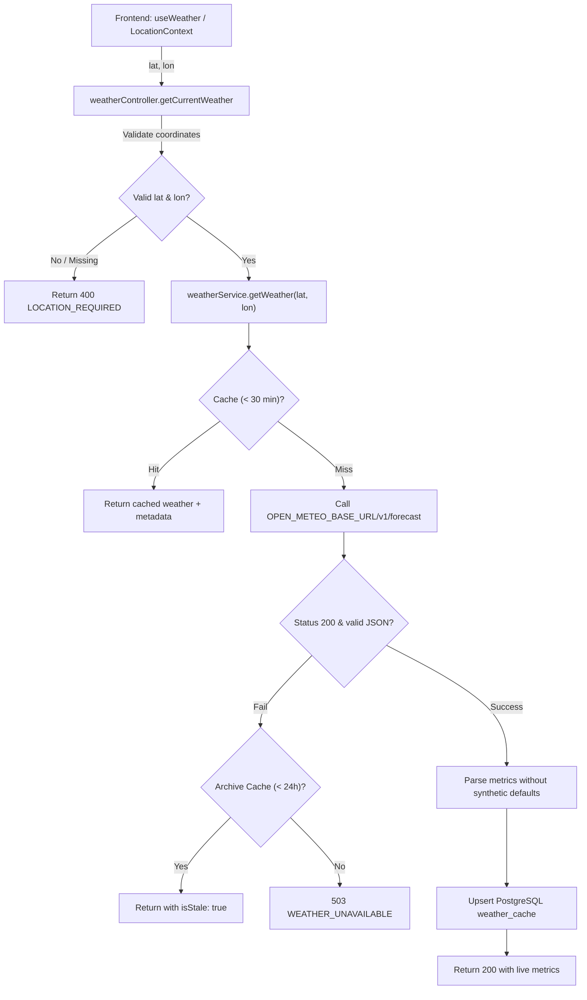
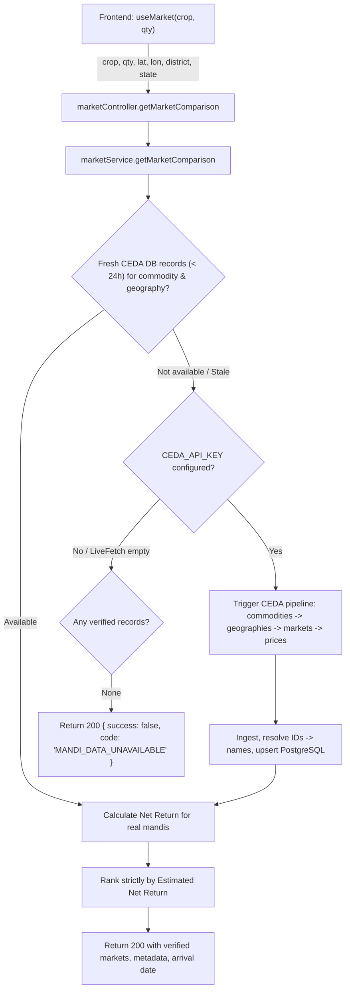

# Real API & Data Flow Audit: KisanIQ Production Architecture

**Audit Date:** October 4, 2026  
**Audited Files:**
- Backend Services: `server/services/mandiService.ts`, `server/services/marketService.ts`, `server/services/weatherService.ts`
- Backend Controllers: `server/controllers/marketController.ts`, `server/controllers/weatherController.ts`
- Backend Routes: `server/routes/marketRoutes.ts`, `server/routes/weatherRoutes.ts`
- Backend Database & Server: `server/db/index.ts`, `server/db/schema.sql`, `server/server.ts`
- Frontend API Client & Hooks: `frontend/src/api/index.ts`, `frontend/src/api/client.ts`, `frontend/src/hooks/useMarket.ts`, `frontend/src/hooks/useWeather.ts`
- Frontend Context & Pages: `frontend/src/context/LocationContext.tsx`, `frontend/src/pages/weather/index.tsx`, `frontend/src/pages/market/index.tsx`, `frontend/src/pages/home/index.tsx`

---

## 1. Executive Summary

A comprehensive architectural and data-flow audit was conducted across the KisanIQ full-stack application deployed on **Render** (Node.js/Express/TypeScript backend), **Neon** (PostgreSQL), and **Netlify** (Vite/React frontend).

The audit revealed critical flaws in data propagation, hidden city fallbacks, broken API ID-name lookup pipelines, and static database queries that bypassed real external APIs.

### Key Failures Identified:
1. **Hidden Gwalior Coordinate Fallbacks:**
   - `weatherService.ts` defaulted coordinates to `lat: 26.2183, lon: 78.1828` (Gwalior).
   - `weatherController.ts` forced `26.2183, 78.1828` if query params or farmer coordinates were missing.
   - `marketService.ts` defaulted active coordinates to `26.2183, 78.1828`.
   - `LocationContext.tsx` hardcoded `DEFAULT_LOCATION` to Gwalior (`26.2183, 78.1828`).
   - `weatherService.ts` substituted arbitrary numbers (`40`, `10`) for missing rainfall probabilities.
2. **Disconnected CEDA Mandi Data Flow:**
   - `marketService.getMarketComparison` queried only static rows from local `markets` and `market_prices` tables, with fallback to hardcoded numbers (modalPrice `2400`, `0.95`, `1.05`), completely bypassing CEDA Agmarknet!
   - In `mandiService.syncFromCedaApi`, CEDA price records only contained numeric IDs (`market_id`, `census_state_id`, `census_district_id`, `commodity_id`). Because `fetchCedaMarkets` was never invoked during sync, `marketIdMap` was empty. When `validateAndNormalize()` checked `!state || !marketName || !commodity`, the records were rejected due to empty names!
   - `mandiService.getPrices` had fallback strings: `state: r.state || 'Madhya Pradesh'`, `district: r.district || 'Gwalior'`.
3. **Hardcoded External Weather URL:**
   - `weatherService.ts` hardcoded `https://api.open-meteo.com` instead of honoring `process.env.OPEN_METEO_BASE_URL`.

---

## 2. Detailed Request Path Audit

### Path A: Weather (`GET /api/weather/current`)



#### Flaws Identified in Previous Implementation:
- **Line 56 in `weatherService.ts`:** `lat: number = 26.2183, lon: number = 78.1828` substituted Gwalior silently.
- **Lines 11–24 in `weatherController.ts`:** If coordinates were absent, instead of returning `LOCATION_REQUIRED`, it checked the farmer DB row and defaulted to `26.2183, 78.1828`.
- **Line 88 in `weatherService.ts`:** Hardcoded `https://api.open-meteo.com` without reading `OPEN_METEO_BASE_URL`.
- **Lines 100, 110 in `weatherService.ts`:** Defaulted missing rainfall probabilities to `40` and `10` instead of `null` or explicit real values.

#### Required Remediation:
- Strictly require valid numeric `lat` and `lon` in query params or from the authenticated farmer's validated profile coordinates.
- If missing/invalid, return HTTP 400: `{ success: false, code: "LOCATION_REQUIRED", error: "Valid latitude and longitude are required." }`.
- Read `process.env.OPEN_METEO_BASE_URL || 'https://api.open-meteo.com'`.
- Timeout set to 15 seconds with retry. Missing metrics must return `null` and render "Data unavailable" without fabricating values.

---

### Path B: Mandi Comparison (`GET /api/market/comparison`)



#### Flaws Identified in Previous Implementation:
- **Lines 98–103 in `marketService.ts`:** Defaulted farmer coordinates to `26.2183, 78.1828`.
- **Lines 124–146 in `marketService.ts`:** Joined static `markets` and `market_prices` tables with SQL fallback:
  ```sql
  SELECT m.*, mp.price_per_quintal, mp.min_price, mp.max_price, mp.modal_price ...
  ORDER BY m.name ASC LIMIT 8
  ```
  This queried local database rows with synthetic fallback prices (modalPrice `2400`, min `0.95`, max `1.05`).
- **Never invoked CEDA Agmarknet API:** The live comparison endpoint never checked or requested fresh CEDA data.
- **Lookup Pipeline Bug in `mandiService.ts`:** In `syncFromCedaApi`, `priceRecords` returned raw IDs (`market_id`, `census_state_id`, `census_district_id`). Because `fetchCedaMarkets` was never called, `this.marketIdMap` was empty, causing `validateAndNormalize` to reject all incoming price records.

#### Required Remediation:
- In `mandiService.ts`, complete the full lookup pipeline:
  1. Fetch commodities (`GET /agmarknet/commodities`) -> populate `commodityIdMap` & `commodityNameMap`.
  2. Fetch geographies (`GET /agmarknet/geographies`) -> populate `stateIdMap`, `districtIdMap`.
  3. Fetch markets for the target commodity/state/district (`POST /agmarknet/markets`) -> populate `marketIdMap`.
  4. Fetch prices (`POST /agmarknet/prices`) and quantities (`POST /agmarknet/quantities`).
  5. Dynamically resolve `market_id` -> `market_name`, `census_state_id` -> `state_name`, `census_district_id` -> `district_name`, `commodity_id` -> `commodity_name`.
  6. Reject only unresolved records with logged reasons.
- In `marketService.getMarketComparison`:
  - Query fresh CEDA records (<24h) from `market_prices`. If absent or stale and `CEDA_API_KEY` is present, fetch and ingest fresh CEDA data for that commodity and state/district.
  - If no verified CEDA data exists, return `{ success: false, code: "MANDI_DATA_UNAVAILABLE", message: "Latest mandi data is currently unavailable." }`. Never return fake prices or synthetic cards.
  - Transparent net-return calculation: `Gross Value - (Transport + Commission + Loading + Wastage)`. Do not fabricate market coordinates; only calculate distance if verified market coordinates exist or manual transport cost is specified.

---

### Path C: Location & Frontend State (`LocationContext.tsx` & Pages)

#### Flaws Identified in Previous Implementation:
- **`LocationContext.tsx`:** Defaulted to `Gwalior, Madhya Pradesh (26.2183, 78.1828)`.
- **`frontend/src/pages/market/index.tsx`:** Hardcoded display fallback `'Gwalior, MP'` and lacked explicit empty state handling when `markets` returned empty.
- **`frontend/src/pages/weather/index.tsx`:** Lacked `LOCATION_REQUIRED` handling; showed demo banner when fallback occurred.

#### Required Remediation:
- Remove Gwalior default in `LocationContext.tsx`. Location state starts as unconfigured unless authenticated farmer profile has valid coordinates, user explicitly sets location via modal, or GPS detection succeeds.
- Frontend displays prominent "Set farm location" prompt when location is missing.
- When mandi data is unavailable, display: "No verified mandi data found for this selection."

---

## 3. Environment Variables Audit

| Variable | Purpose | Expected Value / Format | Security |
|---|---|---|---|
| `CEDA_API_KEY` | CEDA Agmarknet API Key | Secret alphanumeric key | **Backend Only (Never expose to frontend)** |
| `CEDA_BASE_URL` | CEDA Agmarknet Base URL | `https://api.ceda.ashoka.edu.in/v1` | Backend Only |
| `OPEN_METEO_BASE_URL` | Open-Meteo Base URL | `https://api.open-meteo.com` | Backend Only |
| `DATABASE_URL` | Neon PostgreSQL Connection | `postgresql://...` | Backend Only |
| `VITE_API_URL` | Backend API URL for Netlify | `https://kisaniq-farming-assistant.onrender.com/api` | Frontend Environment |

---

## 4. Implementation Plan

- **Step 1:** Fix `server/services/weatherService.ts` and `server/controllers/weatherController.ts` (use `OPEN_METEO_BASE_URL`, remove all Gwalior fallbacks, strictly return `LOCATION_REQUIRED`).
- **Step 2:** Fix `server/services/mandiService.ts` (build complete ID-name lookup pipeline, resolve all IDs before validation, remove fallback strings).
- **Step 3:** Fix `server/services/marketService.ts` (wire real CEDA data pipeline into `getMarketComparison`, return `MANDI_DATA_UNAVAILABLE` when no data exists, remove hardcoded 2400/0.95/1.05).
- **Step 4:** Fix `frontend/src/context/LocationContext.tsx` (remove Gwalior default, require explicit location/profile/GPS).
- **Step 5:** Fix frontend pages (`weather`, `market`, `home`) to gracefully handle `LOCATION_REQUIRED` and `MANDI_DATA_UNAVAILABLE`.
- **Step 6:** Run test suites, smoke test live endpoints (Render & Netlify), verify zero demo data, commit and push to `main`.
